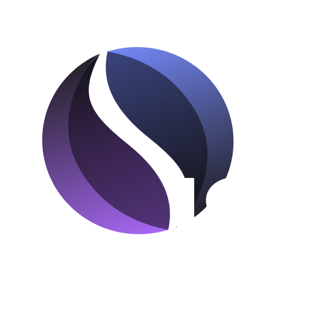

# ShadeJS 


ShadeJS is a typescript SDK for interacting with <a href="https://shadeprotocol.io/" target="_blank">Shade Protocol</a> and <a href="https://scrt.network/" target="_blank">Secret Network</a> smart contracts. It is designed as a wrapper for <a href="https://github.com/scrtlabs/secret.js" target="_blank">Secret.js</a> and abstracts the complexity of secret client management (for queries), as well as providing simple-to-use typescript interfaces for the inputs and outputs of contracts. In addition, it implements multi-query optimizations in order to obtain large on-chain data sets in a highly efficient manner.


<p align="center">
  
  
</p>

## Yarn
Yarn is the default package manager.

## Build 
```
$ yarn
```

## Test 
```
$ yarn test
```

## Docs
Docs will be available on a vitepress site. You can run the site locally with this command:
 
```
$ yarn docs:dev
```